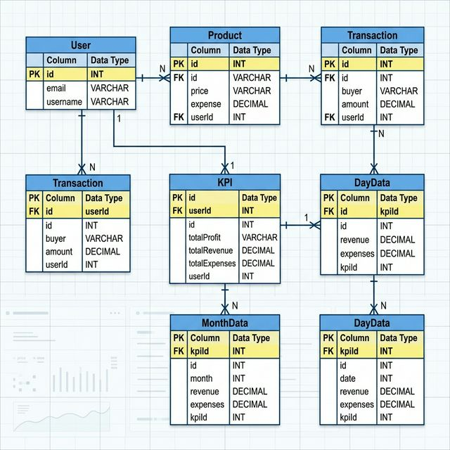

# Enterprise Finance Performance & Projection Dashboard

A professional-grade financial analytics platform utilizing a decoupled architecture to provide real-time KPI tracking and deep-learning-based revenue forecasting.

## Architecture Overview

The system is composed of two primary services:

1. **Frontend (Client)**: A high-performance React application built with TypeScript and Vite. It utilizes Redux Toolkit (RTK Query) for state management and Nivo for advanced data visualization.
2. **Primary Backend (API)**: A Node.js and Express.js server managing authentication, the data persistence layer via Prisma ORM, and integration with the Hugging Face Inference API for strategic AI forecasting (Llama-3).

## Technology Stack

### Frontend

- **Framework**: React 19, TypeScript, Vite
- **Styling**: Material UI (MUI 5), Framer Motion (Animations)
- **State/API**: Redux Toolkit, RTK Query
- **Charts**: Nivo, D3-based visualizations

### Backend (Node.js)

- **Runtime**: Node.js v19+
- **Framework**: Express.js
- **ORM**: Prisma
- **Database**: PostgreSQL (Neon.tech)
- **Security**: JWT Authentication, Helmet, CORS
- **AI Engine**: Hugging Face (Llama-3.3-70B for both numerical forecasting and strategic analysis)

## Database Schema (ERD)

The following diagram illustrates the PostgreSQL relational structure managed by Prisma:



## Getting Started

### 1. Repository Setup

```bash
git clone <repository-url>
cd Finance-DashBoard
```

### 2. Node.js API Setup

```bash
cd server
npm install
```

Configure `.env` with the following variables:

- `DATABASE_URL`: PostgreSQL connection string
- `JWT_SECRET`: Secure signing key
- `HF_API_KEY`: Hugging Face API token

Start the server:

```bash
npm run dev
```

### 4. Frontend Client Setup

```bash
cd ../client
npm install
```

Configure `.env` with:

- `VITE_BASE_URL`: URL of the Node.js API

Start the development server:

```bash
npm run dev
```

## Deployment

### Render Configuration

- **Node.js API**: Deploy `server` folder as a Web Service.
- **Frontend**: Deploy `client` folder to Netlify or Render Static Site.
